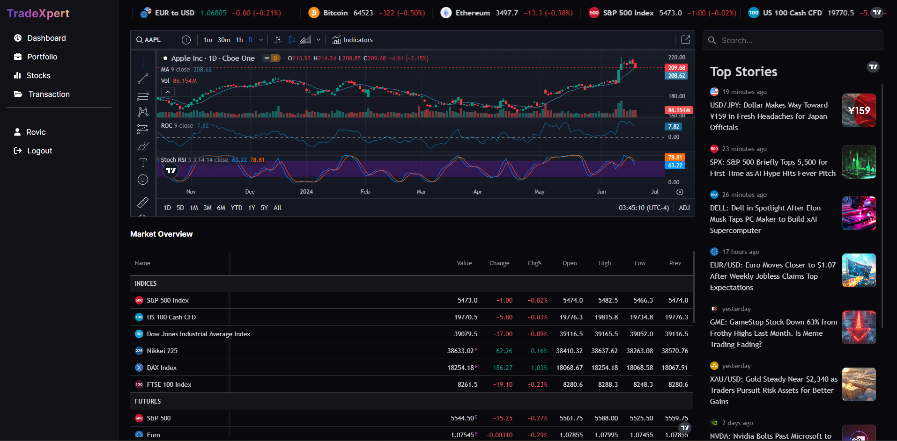

# TradeXpert

This is a simple trading app project built using Devise for authentication, Tailwind CSS for styling, Turbo Stimulus for interactivity, RSpec for testing, and the IEX API for fetching stock market data.

## Features

### Market Data Visualization

- Employs custom-built charts and widgets, as well as those from [Trading View](https://www.tradingview.com/), to deliver interactive and insightful market data visualization.
- Enhances user experience with comprehensive views of stock trends and market analysis, leveraging both proprietary and third-party tools.

### Trader Features

- **Account Management**:
  - Create an account to buy and sell stocks.
  - Log in with credentials to access the account.
  - Receive email confirmation for pending account signup.
  - Receive approval email once trader account is approved.
- **Stock Trading**:
  - Buy stocks to add to the investment portfolio (Requires account approval).
  - Sell stocks to realize gains.
- **Portfolio Management**:
  - View My Portfolio page to see all owned stocks.
  - Access Transaction page to monitor all buying and selling transactions.

### Admin Features

- **Trader Management**:
  - Create new traders and manually add them to the app.
  - Edit trader details to update information.
  - View details of specific traders.
- **Account Approval**:
  - Manage pending trader sign-ups to approve new registrations.
  - Monitor all transactions to ensure smooth operation of the app.

## Technologies Used

- **Devise**: Authentication system for user management.
- **Tailwind CSS**: Utility-first CSS framework for styling.
- **Turbo Stimulus**: Enhances interactivity in Rails applications.
- **RSpec**: Testing framework for Rails applications.
- **IEX API**: Provides stock market data.

## Installation

1. Clone the repository: `git clone <repository-url>`
2. Install dependencies: `bundle install`
3. Set up the database: `rails db:create`
   `rails db:migrate`
4. Obtain an API key from the [IEX API](https://iexcloud.io/) if you haven't already.
5. Set up environment variables for IEX API keys in .env file: `IEX_API_KEY=your_iex_api_key_here`
6. Start the Rails server: `rails server`
7. Open your web browser and visit `http://localhost:3000` to view the application.

## Testing

RSpec is used for testing. To run the tests, use the following command: `bundle exec rspec`
This will run all the tests and provide feedback on the application's behavior.

## Contributing

Contributions are welcome! This project is intended for educational purposes, and we appreciate any enhancements or bug fixes you can provide. To contribute, please follow these steps:

1. Fork the repository.
2. Create a new branch: `git checkout -b feature/enhancement or bugfix/issue-description`
3. Make your changes.
4. Commit your changes: `git commit -am 'Add feature/enhancement' or 'Fix bug: issue description'`
5. Push to the branch: `git push origin feature/enhancement or bugfix/issue-description`
6. Create a new **Pull Request**.

## Acknowledgment

We would like to express our gratitude to the dedicated contributors who have helped shape and improve TradeXpert and its market data visualization features. Your efforts and expertise have been instrumental in creating a robust trading platform. Thank you for your valuable contributions and commitment to making TradeXpert a success.

## Credits

TradeXpert draws inspiration from the need for accessible and user-friendly trading applications. The platform aims to provide traders with essential tools for managing their investments effectively. Design and functionalities are influenced by modern web development practices to ensure a seamless user experience. Market data visualization is powered by custom-built charts and widgets, as well as tools from [Trading View](https://www.tradingview.com/), enhancing the trading experience with comprehensive insights into stock trends and market analysis.

## License

This project is for personal and educational purposes only. All content related to TradeXpert, including its design, functionalities, and concept, is the property of its respective owners.
